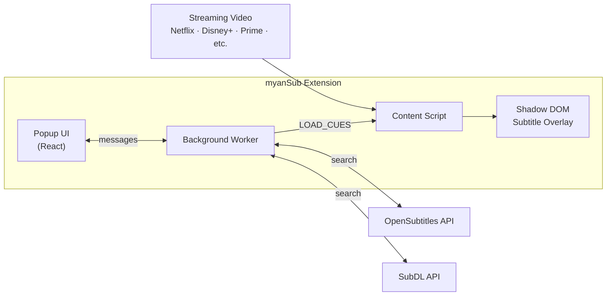
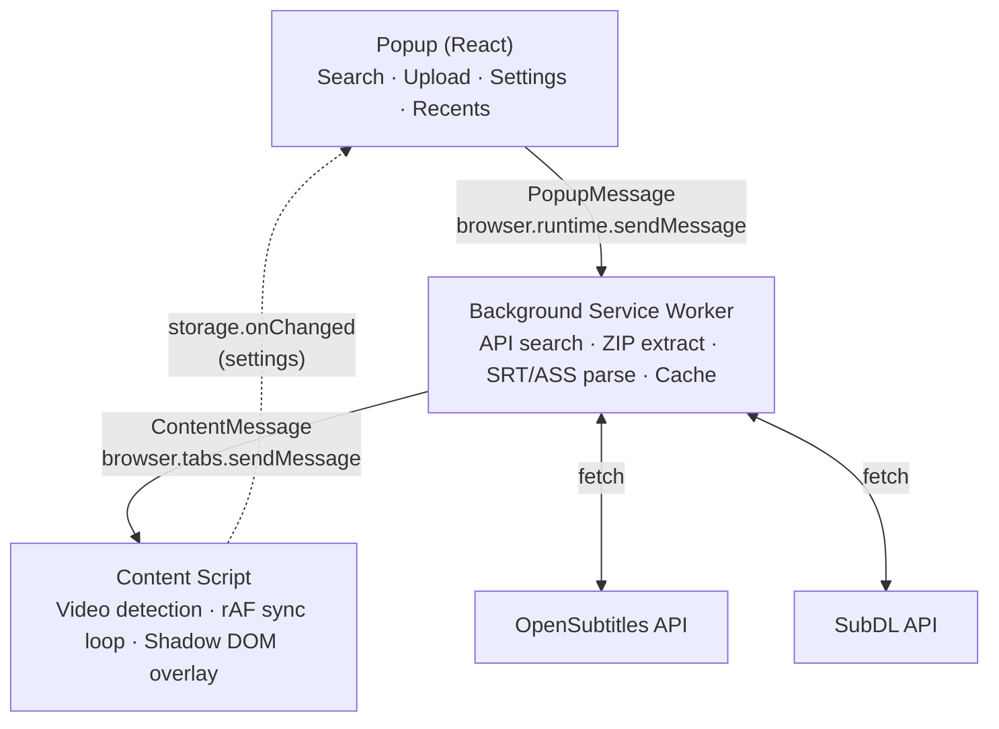
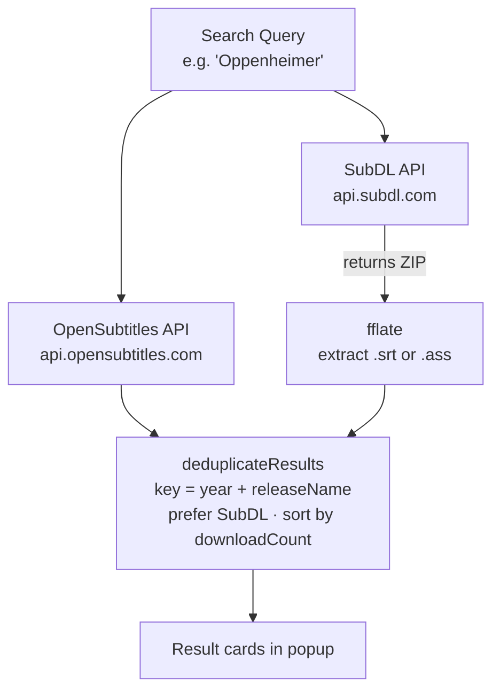

<div align="center">

# myanSub

Myanmar subtitle overlay for streaming video

[](LICENSE)
[](https://wxt.dev)
[](https://developer.chrome.com/docs/extensions/mv3/)
[](https://www.typescriptlang.org/)
[](tests/)

</div>

---

## What is myanSub?

**myanSub** is a browser extension that overlays Myanmar subtitles on any streaming video — Netflix, Disney+, Prime Video, Apple TV+, HBO Max and more. It runs entirely in your browser, searches two subtitle databases in parallel, and renders subtitles inside a Shadow DOM so streaming sites can never interfere with them.



---

## Features

| Feature | Description |
|---------|-------------|
| **Dual-source search** | Searches OpenSubtitles and SubDL simultaneously; deduplicates results |
| **Auto title detection** | Reads the page to pre-fill the search query (works on 9+ platforms + pirate sites via og:title) |
| **Movie & TV support** | Filter by season and episode number |
| **Local file support** | Load `.srt`, `.ass`, or `.ssa` files directly from your device |
| **Real-time sync** | Frame-accurate subtitle timing with keyboard offset controls |
| **Shadow DOM overlay** | Injected subtitles that streaming sites can't block or style |
| **Recent history** | One-click reload of your last 5 subtitle files |
| **Display controls** | Font size (16–40 px) and vertical position (5–50 %) |
| **Firefox + Chrome** | Manifest V3, works on both browsers |

---

## How It Works



---

## Installation

### From source (Chrome)

```bash
git clone https://github.com/heinthant2k4/mmSub.git
cd mmSub
pnpm install
pnpm build          # outputs to .output/chrome-mv3/
```

1. Open `chrome://extensions`
2. Enable **Developer mode** (top right)
3. Click **Load unpacked** → select `.output/chrome-mv3/`

### From source (Firefox)

```bash
pnpm build --browser firefox   # outputs to .output/firefox-mv3/
```

1. Open `about:debugging#/runtime/this-firefox`
2. Click **Load Temporary Add-on** → select any file inside `.output/firefox-mv3/`

### Development (hot reload)

```bash
pnpm dev            # Chrome
pnpm dev --browser firefox
```

---

## Usage

```
1. Open a streaming site (Netflix, Disney+, Prime Video…)
2. Click the myanSub extension icon in the toolbar
3. Type the movie or TV show title  →  Search
4. Click a result to load subtitles
5. Subtitles appear over the video immediately
```

**Keyboard shortcuts** (work while video is playing):

| Shortcut | Effect |
|----------|--------|
| `Alt + ←` | Subtitle −0.5 s |
| `Alt + →` | Subtitle +0.5 s |
| `Alt + Shift + ←` | Subtitle −1 s |
| `Alt + Shift + →` | Subtitle +1 s |
| `Alt + C` | Clear subtitles |

---

## Project Structure

```
mmSub/
├── entrypoints/
│   ├── background.ts        # Service worker — API relay, caching, tab state
│   ├── content.ts           # Injected into every page — video detection, sync loop
│   └── popup/
│       ├── App.tsx          # React popup UI (Material Design 3)
│       ├── index.html
│       ├── main.tsx
│       └── style.css
├── lib/
│   ├── api-client.ts        # OpenSubtitles REST API client
│   ├── subdl-client.ts      # SubDL API client + ZIP extraction (fflate)
│   ├── ass-parser.ts        # ASS/SSA subtitle format parser
│   ├── srt-parser.ts        # SRT subtitle format parser
│   ├── sync-engine.ts       # Binary search cue lookup + offset accumulation
│   ├── overlay.ts           # Shadow DOM overlay — subtitle + toast rendering
│   ├── title-detector.ts    # Universal title detection (streaming + pirate sites)
│   ├── shortcut-handler.ts  # Keyboard shortcut handler (pure, testable)
│   ├── dedup.ts             # Result deduplication across subtitle sources
│   ├── cache.ts             # chrome.storage.local subtitle cache
│   ├── messages.ts          # Typed message contracts (Popup↔Background↔Content)
│   └── config.ts            # API keys and base URLs
├── public/
│   ├── icon.svg             # Source icon (generates icon-16/48/128.png)
│   ├── fonts/               # Noto Sans Myanmar (bundled, no CDN)
│   └── rules.json           # declarativeNetRequest — User-Agent injection
├── tests/                   # 196 Vitest unit tests
└── wxt.config.ts
```

---

## Subtitle Sources

myanSub searches **two sources in parallel** and merges the results:



---

## Supported Formats

| Format | Extension | Notes |
|--------|-----------|-------|
| SubRip | `.srt` | Standard numbered cue format |
| Advanced SubStation Alpha | `.ass` | Override tags stripped, `Format:` line respected |
| SubStation Alpha | `.ssa` | Treated as ASS |

---

## API Keys

The extension ships with shared API keys for demonstration. For production use, obtain your own:

- **OpenSubtitles**: https://www.opensubtitles.com/consumers — free tier available
- **SubDL**: https://subdl.com/api — free tier available

Update `lib/config.ts` with your keys.

---

## Contributing

See [CONTRIBUTING.md](CONTRIBUTING.md) for guidelines.

```bash
# Run tests
pnpm test

# Type check
pnpm typecheck

# Build all
pnpm build
```

---

## License

[MIT](LICENSE) — heinthant2k4
