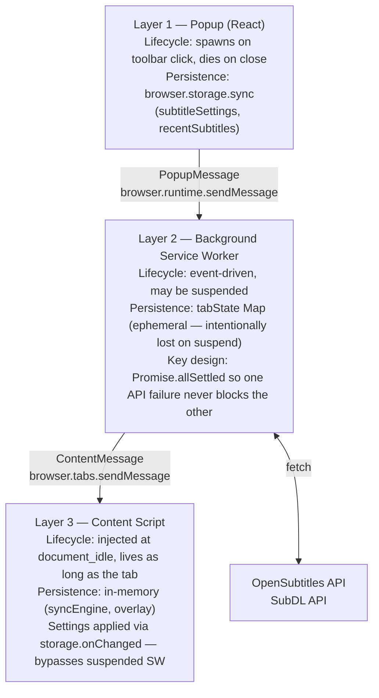
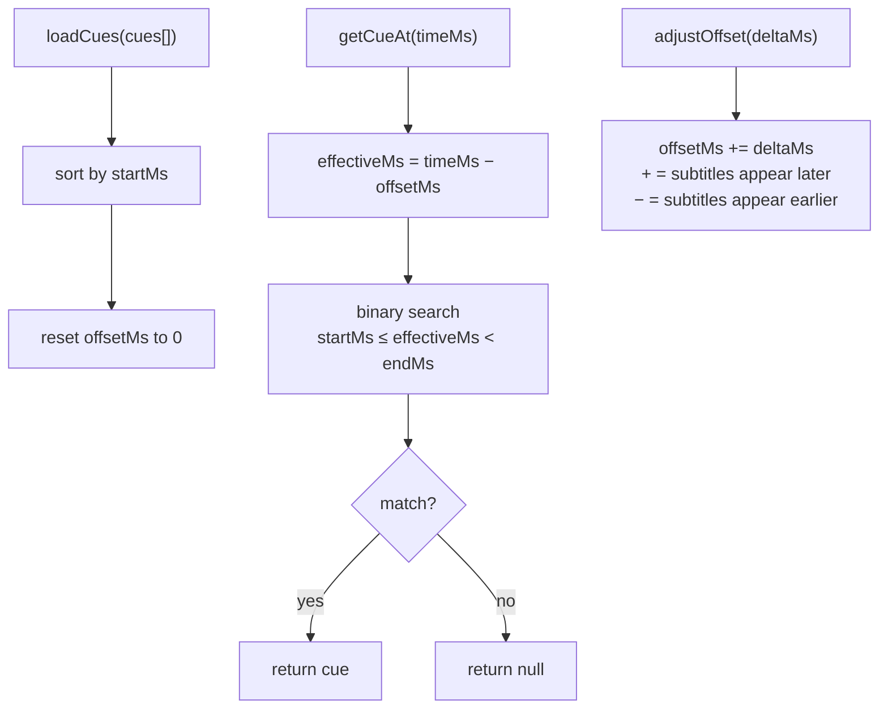
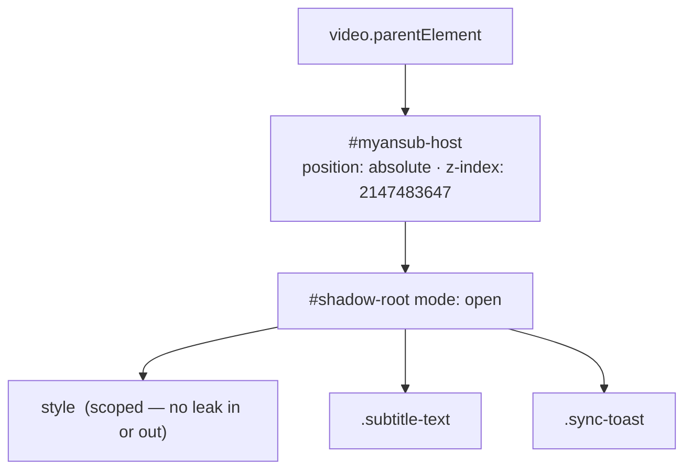
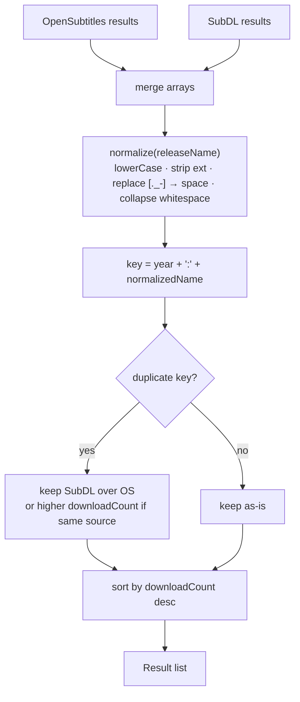
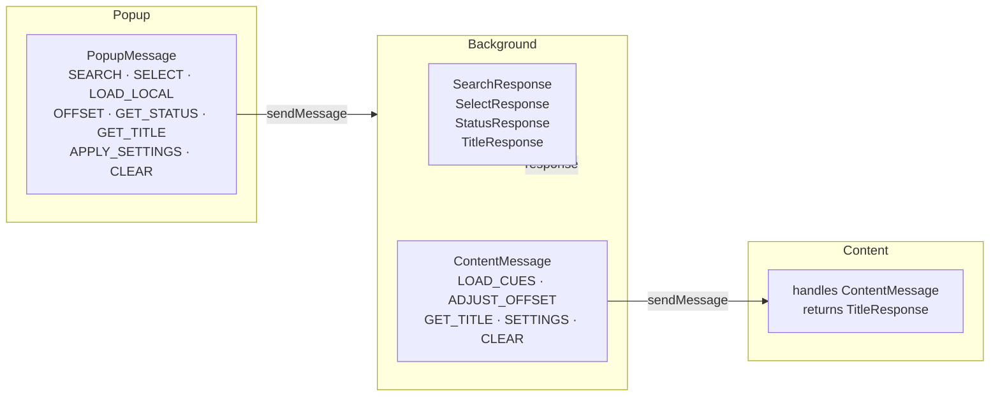

# Architecture

## Three-Layer Extension Model

Browser extensions built on Manifest V3 have three isolated JavaScript contexts. myanSub uses all three.

---

## Sync Engine

The sync engine converts a flat array of cues into frame-accurate subtitle display.

The binary search is O(log n). A 2-hour film with ~7 200 cues completes in ~13 iterations — cheap enough to run inside a 60 fps `requestAnimationFrame` loop without dropping frames.

---

## Shadow DOM Overlay

Streaming sites aggressively style the video container and inject their own overlays. Attaching subtitle elements directly to the DOM risks CSS conflicts, JavaScript removal, and z-index wars.

myanSub solves this with a Shadow DOM host:

The host is repositioned by a `ResizeObserver` on the video element and moved inside the fullscreen element on `fullscreenchange`.

---

## Subtitle Deduplication

Both APIs often return the same subtitle file. Deduplication runs after merging:

---

## Message Type Contracts

All communication between layers is typed in `lib/messages.ts`. Adding a new message requires:

1. Add variant to `PopupMessage` or `ContentMessage`
2. Handle it in the receiving `switch` statement
3. TypeScript will error if any case is unhandled (exhaustive check via `satisfies`)

This prevents the most common extension bug: sending a message that nobody listens for.

